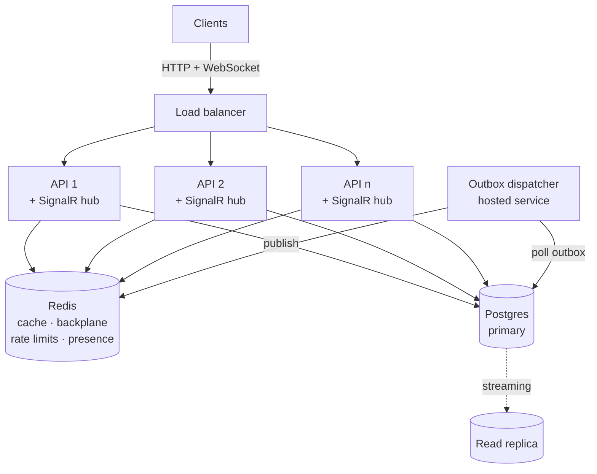

# Scaling, Caching, and Real-Time Design

Status: Phases 0–2 shipped, Phase 3 proposed · Scope: `server/BoardSync.Api` ·
Companion to `docs/activity-feed-frontend.md`

---

## 1. Where the system stands today

The good news first, because it shapes everything below: **the API is already stateless**. Auth is JWT
bearer with no server-side session, no in-memory user state, no local file writes. That is the hard
part of horizontal scaling and it is already done.

The module boundaries are also real. `Modules/OrgProject`, `Modules/Sprints`, `Modules/WorkItems`,
`Modules/Activity` and `Modules/Rbac` each own their data and talk through domain events. That means
the changes below are mostly additive — no module needs to be torn open.

What will not survive growth, in order of how soon it bites:

### 1.1 The event bus is in-process, post-commit, and lossy

`InMemoryEventBus` resolves handlers from a fresh DI scope and swallows every handler exception
(`Shared/Kernel/Events/InMemoryEventBus.cs:36-41`). Services publish *after* committing:

```csharp
await _repository.SaveChangesAsync(ct);              // WorkItemService.cs:100
await _eventBus.PublishAsync(new WorkItemCreated(...), ct);  // WorkItemService.cs:102
```

Three consequences:

1. **Activity entries can be silently lost.** The work item commits, then `ActivityRecorder` writes
   the log row in a *separate* transaction (`Modules/Activity/Services/ActivityService.cs:21-28`).
   A crash, a timeout, or a swallowed exception between the two leaves history with a hole and no
   error surfaced to anyone.
2. **Handlers only fire on the instance that served the write.** The moment there are two API pods,
   any cross-instance reaction — including pushing a real-time message to a user connected elsewhere —
   simply does not happen.
3. **Handler latency is request latency.** Activity writes are on the caller's clock.

This single component is the blocker for both real-time and multi-instance. Everything else is
tuning; this is architecture.

### 1.2 Every authorized request pays 1–2 database queries for RBAC

`RbacService.HasRoleAsync` loads role assignments for the scope
(`Modules/Rbac/Services/Implementations/RbacService.cs:69-72`), and when the direct match fails it
runs a second query to test org-admin inheritance (`:179-196`). Controllers call this on essentially
every action (`WorkItemsController.cs:258`, and the equivalents in Boards, Sprints, Projects, Teams).

Some requests pay it more than once — the controller guard checks, then a service method re-resolves
the same scope. At current volume it is invisible. At 50 rps it is the single most-executed query in
the system, and it is the most cacheable data in the system: role assignments change rarely and are
read constantly.

### 1.3 Aggregate endpoints do sequential round trips over materialized ID lists

`WorkspaceController.GetSummary` (`Modules/OrgProject/Controllers/WorkspaceController.cs:51-81`)
issues four sequential queries, pulling `orgIds` and `projectIds` into memory and shipping them back
as `IN` lists. `GetNotifications` repeats the first two, then sorts `WorkItemHistory` by `CreatedAt`
across all of them — and `WorkItemHistory` has indexes on `WorkItemId` and `ChangedBy` only
(`Shared/Data/BoardSyncDbContext.cs:117-118`), no index supporting that sort. That query degrades
linearly with total history volume, forever.

`BoardService.BuildBoardResponseAsync` (`Modules/Sprints/Services/BoardService.cs:196-245`) is five
sequential queries — project → team, team → active sprint, sprint → work items, work items → tags,
plus the board load itself — to render the screen users stare at all day.

### 1.4 Reorder is whole-list rewrite with last-writer-wins

Both backlog reorder (`Modules/Sprints/Services/SprintService.cs:312-331`) and column reorder
(`Modules/Sprints/Services/BoardService.cs:139-158`) accept the full ordered ID list and rewrite
`Position` on every row. There is no concurrency token anywhere in the schema — no `RowVersion`, no
`IsConcurrencyToken`.

Single-user, this is fine. The instant two people drag cards on the same board — which is precisely
what "real-time" invites them to do — the second save silently reverts the first person's move,
because it wrote back an ordering computed before that move existed. Adding a live board without
fixing this makes the product *feel* broken in a way the current polling-and-refresh UX hides.

### 1.5 Things that break the moment a second instance starts

| Component | Problem at N instances |
|---|---|
| Startup auto-migration (`Program.cs:328`) | Instances race to apply the same migration; EF has no cross-process lock here |
| Rate limiter (`Program.cs:142-147`) | Counters are per-process — N pods means N× the configured limit |
| Event bus | Handlers fire only on the writing instance |
| Connection pool (`Program.cs:294`) | `MaxPoolSize=100` per instance × N vs Postgres `max_connections` default of 100 |

The pool one is worth stating plainly: **three pods with the current settings can exhaust a default
Postgres server on their own**, before any user load.

### 1.6 No caching of any kind

No `IMemoryCache`, no `IDistributedCache`, no Redis, no response caching, no ETags. Every read goes
to Postgres.

### 1.7 Offset pagination on the fastest-growing table

`ActivityQueryService` uses `Skip`/`Take` (`Modules/Activity/Services/ActivityService.cs:58-63`).
`ActivityLogs` is append-only and grows faster than every other table combined. Deep pages get
slower without bound, and rows shift under a paginating client as new activity arrives.

---

## 2. Target architecture



The API instances stay stateless (JWT, no session). The dispatcher path — durable events leaving
the database and reaching every connected client regardless of which instance served the write —
is the part that does not exist today.

Three new pieces of infrastructure: **Redis**, an **outbox table + dispatcher**, and a **SignalR
hub**. Everything else is existing code, tuned.

---

## 3. The keystone change: transactional outbox

Do this before real-time or multi-instance. Both depend on it, and it independently fixes the
activity-loss bug.

### 3.1 Schema

```sql
CREATE TABLE outbox.messages (
    sequence      BIGSERIAL PRIMARY KEY,   -- global monotonic order; clients resume from this
    event_id      UUID        NOT NULL UNIQUE,
    event_type    TEXT        NOT NULL,    -- "WorkItemStateChanged"
    payload       JSONB       NOT NULL,
    topics        TEXT[]      NOT NULL,    -- ['project:…','board:…','org:…']
    occurred_at   TIMESTAMPTZ NOT NULL,
    dispatched_at TIMESTAMPTZ NULL
);
CREATE INDEX ix_outbox_undispatched ON outbox.messages (sequence)
    WHERE dispatched_at IS NULL;
```

### 3.2 Write path

`IEventBus.PublishAsync` stops invoking handlers inline. It **enqueues into the same `DbContext`**,
so the event row commits in the same transaction as the domain change:

```csharp
// WorkItemService — note the reversal: publish (enqueue) BEFORE save
_eventBus.Enqueue(new WorkItemStateChanged(...));
await _repository.SaveChangesAsync(ct);   // domain row + outbox row, one transaction
```

Atomic by construction. No commit, no event. Commit, guaranteed event.

### 3.3 Dispatch path

A `BackgroundService` claims undispatched rows with `FOR UPDATE SKIP LOCKED` (so it stays correct
when several instances run it), then for each row:

1. invokes the in-process handlers — `ActivityRecorder` and friends, unchanged;
2. publishes to the SignalR hub groups named in `topics`;
3. marks `dispatched_at`.

Use Postgres `LISTEN/NOTIFY` to wake the dispatcher on insert, with a 1-second poll as the fallback
so a missed notification costs latency rather than delivery.

### 3.4 What this obligates

Delivery becomes **at-least-once**, so handlers must be idempotent. `ActivityRecorder` gets a unique
index on the originating `EventId` and an upsert. That is the whole cost, and it is the right trade:
today's design is at-most-once with silent loss, which is strictly worse.

**Ordering guarantee:** `sequence` is globally monotonic. Per-topic ordering follows from it, which
is what makes client resume (§4.4) possible.

---

## 4. Real-time

### 4.1 Transport: SignalR over WebSockets

Use `Microsoft.AspNetCore.SignalR` with the `Microsoft.AspNetCore.SignalR.StackExchangeRedis`
backplane.

Rationale: first-party for ASP.NET Core, groups map exactly onto the topic model below, the Redis
backplane is a supported drop-in for multi-instance fanout, and transport fallback (WebSocket → SSE →
long polling) is free — which matters for corporate proxies. Raw SSE would be simpler but is
one-directional, and presence, subscribe/unsubscribe, and resume-from-sequence all want a client→server
channel. Raw WebSockets means rebuilding groups, reconnect, and backplane by hand.

Configure `SkipNegotiation` + WebSockets-only on the client where possible, which removes the need
for sticky sessions at the load balancer.

### 4.2 Topic model

One hub, `/hubs/workspace`, with explicit subscribe/unsubscribe methods mapping to SignalR groups:

| Topic | Carries | Subscribed by |
|---|---|---|
| `user:{userId}` | notifications, "assigned to you", mentions | always, on connect |
| `org:{orgId}` | activity feed, membership and role changes | org dashboard, activity page |
| `project:{projectId}` | work item created/updated/deleted, comments | project views |
| `board:{boardId}` | card moves, column add/edit/reorder, WIP changes | open board |
| `sprint:{sprintId}` | backlog order, add/remove, sprint status | sprint/backlog view |

Subscription is authorized on `Subscribe`, not on connect — `RbacService.HasRoleAsync` against the
topic's scope, minimum `Reader`. This is exactly why the RBAC cache (§5.2) is load-bearing: a
reconnect storm after a deploy re-authorizes every topic for every client at once.

Re-authorize periodically for long-lived connections (every ~5 minutes), and force-drop a client from
a group when a role-revocation event arrives on that scope. Otherwise a user removed from a project
keeps receiving its cards until they close the tab.

### 4.3 Event → message mapping

Existing domain events already carry what the client needs. `WorkItemStateChanged` has
`WorkItemId, ProjectId, OldState, NewState, ChangedByUserId` — enough to patch a board without a
refetch.

| Domain event | Topics | Client effect |
|---|---|---|
| `WorkItemStateChanged` | `project:`, `board:` | move card between columns |
| `WorkItemCreated` / `Deleted` | `project:`, `board:` | add / remove card |
| `WorkItemAssigned` | `project:`, `board:`, `user:` (both) | swap avatar; notify new assignee |
| `WorkItemCommentAdded` | `project:`, `user:` (watchers) | comment badge, notification |
| `SprintWorkItemAdded/Removed` | `sprint:`, `board:` | backlog and board membership |
| `SprintStatusChanged` | `sprint:`, `project:`, `org:` | board switches active sprint |
| `BoardChanged` | `board:` | column set changed |
| `MemberAddedToOrg` / `OrgMemberRoleChanged` | `org:`, `user:` | member list; re-auth the affected user |
| *(all of the above)* | `org:` | prepend activity feed entry |

**Payload rule:** send a self-sufficient delta plus `sequence`, never a bare "something changed, go
refetch". A bare invalidation turns every write by every user into a read from every other user —
the fanout that kills the database precisely when the room is busiest.

The exception is genuinely structural change (board columns reordered, sprint switched): send an
explicit `invalidate` with the scope, and let the client refetch once.

### 4.4 Connection lifecycle and the resume protocol

The failure mode to design against is not the disconnect — it is the *silent* stale client after a
reconnect that missed messages.

```mermaid
sequenceDiagram
    participant C as Client
    participant H as Hub

    C->>H: connect (JWT)
    C->>H: Subscribe("board:X", lastSequence: null)
    H-->>C: snapshot + currentSequence
    H-->>C: deltas (seq n, n+1, …)

    Note over C,H: network drops — 40s pass

    C->>H: reconnect; Subscribe("board:X", lastSeq: n)

    alt gap ≤ 200 messages and ≤ 5 min
        H-->>C: replay seq n+1 … m from outbox
    else gap too large
        H-->>C: { resync: true } → client refetches snapshot
    end
```

The outbox is what makes replay possible — it is already a durable, ordered, per-topic log. No
second event store is needed.

Client keeps `lastSequence` per topic. Server replays from the outbox on resubscribe, bounded; past
the bound it returns `resync` and the client refetches the snapshot. Bounded replay keeps a client
that was asleep for six hours from dragging a million rows through the hub.

### 4.5 Fixing reorder for concurrent editing

Live boards make §1.4 a user-visible bug, so it ships with the real-time work, not after.

**Replace integer `Position` with a fractional rank.** Store rank as `numeric` (or a LexoRank-style
string). A move becomes a single-row update:

```
move X between A and B  →  rank(X) = midpoint(rank(A), rank(B))
```

- The request carries only the moved item and its two neighbours — not the whole list.
- Two people moving different cards no longer collide at all.
- Two people moving the *same* card resolve by last-write-wins on one row, which is both correct and
  what users expect.
- Wire format for the real-time message is tiny: `{workItemId, newRank, movedBy, sequence}`.

Add a maintenance job to rebalance ranks when adjacent values converge (rare; roughly after ~50
repeated insertions into the same gap).

**Add optimistic concurrency to work items.** A `RowVersion` concurrency token on `WorkItem` (mapped
to Postgres `xmin`, which needs no schema change) makes state changes fail loudly on conflict instead
of silently overwriting. Return `409` with the current state; the client already has a live
subscription, so it can reconcile without a refetch.

### 4.6 Presence (optional, cheap once the hub exists)

"Who is viewing this board" and "who is dragging this card" are Redis-only concerns: a per-topic set
with per-connection TTL, refreshed on heartbeat, broadcast on change. No database involvement. Worth
doing only after §4.5 — presence on a board that loses your drags is decoration on a broken thing.

---

## 5. Caching

Introduce `HybridCache` (.NET 9+): L1 in-process memory, L2 Redis, one API, with stampede protection
and tag-based invalidation built in. It is a better fit here than raw `IDistributedCache` because
most of these entries want both tiers.

### 5.1 The layers

| Layer | Technology | Use for |
|---|---|---|
| L0 | Scoped dictionary / `HttpContext.Items` | Repeated identical work *within one request* — chiefly RBAC |
| L1 | `HybridCache` in-memory, seconds | Hot, small, tolerant of brief staleness |
| L2 | `HybridCache` → Redis, minutes | Shared across instances; survives pod restarts |

### 5.2 What to cache

| Data | Layer | Key | TTL | Invalidation |
|---|---|---|---|---|
| **Effective role** for (user, scope, scopeId) | L0 + L1 60s + L2 5m | `rbac:v1:{userId}:{scope}:{scopeId}` | 60s / 5m | explicit, on any `RoleAssignment` or membership write |
| User's org ID list | L1 + L2 | `orgs:v1:{userId}` | 5m | on org membership change |
| Board snapshot (columns + cards) | L2 | `board:v1:{projectId}:{ver}` | 60s | version bump (§5.3) |
| Workspace summary counters | L2 | `wssum:v1:{userId}` | 30s | TTL only — counts tolerate staleness |
| Display names (user, org, project, team) | L1 | `name:v1:{type}:{id}` | 10m | on rename event |
| Activity feed, page 1 per org | L2 | `feed:v1:{orgId}:p1` | 15s | delete on new activity for that org |
| Revoked refresh tokens / JTIs | L2 Redis | `revoked:{jti}` | token lifetime | on logout / revoke |
| Rate-limit counters | Redis | — | window | — |

**RBAC is the headline.** It is the most-read data in the system, changes rarely, and is currently
1–2 queries on every single authorized request. Cache it and a large fraction of database traffic
disappears — before any query tuning.

The L0 tier alone (memoize `HasRoleAsync` for the duration of one request) is a handful of lines,
needs no Redis, and removes the duplicate checks today. Ship it in Phase 0.

### 5.3 Invalidation: version stamps, not broad deletes

For anything assembled from several tables — the board especially — do not try to delete every key
that might be affected. Keep a version counter in Redis and put it in the key:

```
INCR board:ver:{projectId}        on any work item / board / sprint event for that project
GET  board:v1:{projectId}:{ver}   read path
```

Old versions expire on their own. No delete storms, no race where an invalidate lands before the
write it was meant to invalidate. Bumping the version is also exactly the moment to publish the
real-time message — one event, both effects.

### 5.4 Security note on caching authorization

Two rules, non-negotiable:

- **Revocation must be explicit, not TTL-driven.** When a role is removed, invalidate the key *and*
  publish an event that drops the user from the matching hub groups. A 5-minute window where a
  removed user still has write access is a real incident, not a cache miss.
- **Cache denials with a shorter TTL than grants** (say 10s). A user who was just granted access
  should see it immediately; a user who was just denied can wait. Never let a cached deny be
  promotable to an allow by any code path.

### 5.5 What not to cache

- **Work item detail** — write-heavy, low reuse, real-time already keeps clients current.
- **Anything already fast and user-specific** — a keyed single-row lookup is cheaper than a Redis
  round trip plus serialization.
- **Search results** — high cardinality, low hit rate.
- **The activity feed past page 1** — nobody reads page 7 twice.

---

## 6. Scaling out

### 6.1 Blockers to clear before instance #2

1. **Remove startup auto-migration** (`Program.cs:328`). Move `dotnet ef database update` into the
   release pipeline as its own step. If you want to keep it in-process, wrap it in a Postgres
   advisory lock so exactly one instance applies it. Racing migrations corrupt schema state, and it
   fails at the worst moment: a rolling deploy.
2. **Move rate limiting to Redis.** Per-process counters (`Program.cs:142-147`) mean the effective
   limit multiplies by the pod count — the `password` policy at 5 per 5 minutes silently becomes 15
   with three pods, which matters because it is a brute-force control.
3. **Fix the connection budget.** `MaxPoolSize=100`, `MinPoolSize=10` per instance (`Program.cs:293-294`).
   Either drop to ~20 per instance or put **pgbouncer** in transaction-pooling mode in front of
   Postgres. Prefer pgbouncer — it decouples pod count from database connection count permanently.
4. **Outbox** (§3) — otherwise handlers fire on one instance only.

### 6.2 Database

**Indexes for the hot paths.** Current indexes are mostly single-column; the hot queries filter on
combinations:

```sql
-- workspace summary + project work item lists
CREATE INDEX ix_workitems_project_active_state
    ON "WorkItems" ("ProjectId", "IsActive", "State");

-- notifications feed: currently an unindexed sort over all history
CREATE INDEX ix_workitemhistory_created_desc
    ON "WorkItemHistory" ("CreatedAt" DESC);

-- board + backlog render
CREATE INDEX ix_sprintworkitems_sprint_position
    ON "SprintWorkItems" ("SprintId", "Position");

-- active sprint lookup on every board render
CREATE INDEX ix_sprints_team_status ON "Sprints" ("TeamId", "Status");
```

The `ActivityLogs` composite `(OrganizationId, OccurredAt DESC)` is already right
(`BoardSyncDbContext.cs:351-352`) — that one was done correctly.

**Keyset pagination for the activity feed.** Replace `Skip`/`Take`
(`ActivityService.cs:58-63`) with a cursor on the existing sort key:

```sql
WHERE "OrganizationId" = ANY(@orgIds)
  AND ("OccurredAt", "Id") < (@lastOccurredAt, @lastId)
ORDER BY "OccurredAt" DESC, "Id" DESC
LIMIT @pageSize
```

The tiebreaker on `Id` is already in the code and already documented there — it is exactly what makes
a stable cursor possible. Constant cost at any depth, and no row-shifting as new activity arrives,
which matters more once activity streams in live.

**Partition `ActivityLogs` by month.** It is append-only, always queried by recency, and grows faster
than everything else. Native declarative partitioning plus a retention policy (drop or archive
partitions past N months) keeps the working set bounded and makes deletion free.

**Read replicas.** Once writes and reads are separable, route the read-only aggregates — activity
feed, workspace summary, search — to a replica via a second `NpgsqlDataSource` and a read-only
`DbContext`. Caveat to handle explicitly: **read-your-own-writes**. After a user's own write, pin
that user's reads to the primary briefly (a Redis flag keyed by user with a few seconds' TTL), or
route from the primary whenever the request carries a sequence newer than the replica has seen.

### 6.3 Query fixes worth doing regardless

These need no infrastructure and pay off immediately:

- **`GetSummary`** (`WorkspaceController.cs:46-85`): four sequential round trips, two of them pulling
  ID lists into memory only to send them back as `IN` parameters. Collapse to one query with
  correlated subqueries returning all four counts.
- **`BuildBoardResponseAsync`** (`BoardService.cs:196-245`): five sequential queries. The
  project → team → active sprint chain is one join; cards and tags are one query with a projection.
  Five round trips to two.
- **`GetNotifications`** (`WorkspaceController.cs:94-140`): add the `CreatedAt` index above, and
  denormalize `ProjectId` onto `WorkItemHistory` so the filter and sort are served by one composite
  index instead of a join to `WorkItems`.

### 6.4 Observability — do this first, actually

Every threshold in this document should be triggered by a measurement, not a hunch. Before Phase 1,
add OpenTelemetry traces and metrics with: per-endpoint p50/p95/p99, EF Core command duration and
count *per request*, connection pool saturation, cache hit ratio per key prefix, outbox lag
(`now() - min(occurred_at) where dispatched_at is null`), and hub connection count plus messages/sec
per topic.

Outbox lag and cache hit ratio are the two numbers that tell you whether this design is working.

---

## 7. Sequencing

Each phase is independently shippable and independently valuable. Do not skip Phase 0 — it is the
cheapest latency you will ever buy.

### Phase 0 — No new infrastructure ✅ **shipped**

- [x] OpenTelemetry traces + the metrics in §6.4 — gated on `Telemetry:OtlpEndpoint`, so it costs
      nothing until a collector exists
- [x] L0 per-request RBAC memoization — `MemoizingRbacService` decorator
- [x] The four indexes in §6.2, plus `ProjectId` denormalized onto `WorkItemHistory`
      (migration `Phase0_HotPathIndexes`, with a backfill for existing rows)
- [x] Keyset pagination for the activity feed — additive `?cursor=` / `nextCursor`; `?page` unchanged
- [x] Collapsed the `GetSummary` (4 queries → 1), board render (5 → 2) and notifications queries
- [x] Startup auto-migration now defaults off in Production and takes a Postgres advisory lock when
      it does run
- [x] `MaxPoolSize` 100 → 20 per instance, `MinPoolSize` 10 → 2, both configurable

**Measured**, on 100k `WorkItemHistory` rows: the notification feed went from a seq scan over every
row (1,644 buffers, 20.2 ms) to an index scan (384 buffers, 5.1 ms). The old plan's cost grows with
total history volume; the new one does not.

Verified end to end against a live instance: summary counts, notification ordering and org-name
resolution, board cards with tags rendering from an active sprint, and cursor paging returning rows
identical to the equivalent offset page with zero overlap. A malformed cursor falls back to the
first page rather than erroring.

*Outcome: materially faster on the same hardware, and safe to run more than one copy of.*

### Phase 1 — Redis and the outbox ✅ **shipped**

- [x] Redis in dev and prod compose; `HybridCache` wired (L1 memory + L2 Redis)
- [x] RBAC decision caching with **version-stamp** invalidation (see the deviation below)
- [x] Redis-backed rate limiting via an atomic Lua increment, failing open on a Redis outage
- [x] Outbox table, `Enqueue`-before-`Save`, dispatcher `BackgroundService` with
      `FOR UPDATE SKIP LOCKED` and `LISTEN`/`NOTIFY` wakeup
- [x] Idempotent activity recording keyed on `EventId`

**Verified against a live stack**, not just compiled:

| Property | How it was proven |
| --- | --- |
| Atomic | A rejected write (duplicate slug → 409) left **zero** outbox rows |
| Delivered | Queued message dispatched, activity entry written, `EventId` identical end to end |
| Idempotent | Message reset to undispatched and redelivered → **no** duplicate feed entry |
| Retried, not lost | Handler failures increment `Attempts` and stay queued rather than vanishing |
| Rate limit shared | 6 requests → Redis counter at 6 with a 60s TTL (never `-1`) |
| Revocation immediate | Role write advanced the user's generation; every prior decision key orphaned |

Full regression also passed: 23 outbox messages drained with 0 pending and 0 failed attempts,
board rendering 6 cards with tags, cursor and offset paging still agreeing.

**Three deviations from the design above, all deliberate:**

1. **Invalidation is by version stamp, not tag eviction.** §5.3 already preferred this, and it
   turned out to be necessary rather than merely preferable: `HybridCache.RemoveByTagAsync` did not
   evict the L2 entry in testing, so a revoked user kept their cached permission. Each user now has
   a Redis counter included in every decision key; bumping it orphans every prior decision
   atomically. This was caught by an end-to-end test, not by the compiler.
2. **Grants and denials share one expiry.** §5.4 wanted denials to expire faster. `HybridCache`
   fixes an entry's lifetime at call time, before the answer is known. The security-critical
   direction — revocation — does not depend on expiry at all now, so this costs only slightly more
   re-asking for denials.
3. **No `topics` column on the outbox yet.** Nothing consumes it until the hub exists in Phase 2,
   and an always-empty column reads like a bug. Phase 2 adds it, or derives topics from the payload
   at dispatch time.

*Outcome: activity can no longer be lost; the largest query load is gone; genuinely multi-instance ready.*

> **Behaviour change worth knowing:** the activity feed is now **eventually consistent**. Events are
> delivered after the transaction commits, so a feed read immediately after a write may not show it
> yet — typically milliseconds via `NOTIFY`, at worst one poll interval. This is the necessary cost
> of the write and the event being atomic, and it is the same delivery path the real-time work in
> Phase 2 builds on.

### Phase 2 — Real-time ✅ **shipped**

- [x] SignalR hub + Redis backplane, at `/hubs/workspace`
- [x] Topic model and subscribe-time authorization
- [x] Dispatcher fans out to hub groups
- [x] Client resume protocol (`lastSequence` → bounded outbox replay → `resync`)
- [x] Fractional ranks for reorder, with a single-row move endpoint
- [x] `xmin` concurrency token on `WorkItem`, surfaced as an opaque `version` with an optional
      `expectedVersion` on writes and a `409` on conflict
- [x] Board snapshot caching with version-stamped keys, bumped by the dispatcher
- [x] Presence, as a Redis sorted set scored by heartbeat so stale entries age out

**Verified with a real WebSocket client** — 18 checks, all passing:

| Area | Proven |
| --- | --- |
| Authorization | Refuses a project with no role, an org it is not in, another user's topic, and a malformed topic; allows its own. Denial reason is identical for "forbidden" and "missing". |
| Live delivery | A REST write reached a subscriber with no polling, carrying sequence, topic, and a usable delta (`title="Live card"`) rather than an invalidation. |
| Resume | Nothing arrives while unsubscribed; resubscribing with `lastSequence` replayed exactly what was missed, all sequences newer than the resume point, `resync: false`. |
| Concurrent reorder | Two simultaneous moves of *different* cards both survived — the case the whole-list reorder silently broke. |

**One deviation:** there is no `board:` topic. A board is one-to-one with its project, so it would
always have identical subscribers to `project:` and only add a second thing to keep in sync. Board
changes ride the project topic.

**A bug this work surfaced:** caching RBAC decisions broke every membership endpoint. `HybridCache`
invokes its factory outside the ambient execution-strategy scope, and EF refuses to start a
retriable operation while a user transaction is open — so any permission check *inside* a
transaction threw a 400. It went unnoticed through Phase 1 because no test had added a member to an
organization. The caching decorator now bypasses the cache inside a transaction, which is also the
right call on its own: code mid-write wants the current answer, not a cached one.

*Outcome: live boards, live activity feed, live notifications — correct under concurrent reordering.*

### Phase 3 — Scale out

- N instances behind the load balancer
- pgbouncer
- Read replica for the read-only aggregates, with read-your-writes handling
- `ActivityLogs` partitioning + retention

*Outcome: capacity is a configuration number rather than an engineering project.*

---

## 8. Open questions

1. **Expected concurrency per board.** Fractional ranks and presence are sized very differently for
   5 concurrent editors than for 50. This changes nothing about the design, only the tuning.
2. **Staleness budget for the workspace summary.** 30s is proposed. If the product wants those
   counters live, they move onto the real-time path and become a different problem.
3. **Activity retention.** Partitioning needs a policy — is 12 months of history a product promise or
   an accident?
4. **Deployment target.** pgbouncer, Redis HA, and hub scale-out all look different on managed
   Kubernetes versus a couple of VMs. Worth settling before Phase 3.
5. **Frontend readiness.** `boardsync-ui` is still the Vite starter template. Phase 2's client
   contract — resume protocol, delta application, conflict reconciliation — is real frontend work
   and should be planned alongside, not after.
