# BoardSync — how it all works

**A project tracker whose board updates itself from git, and which will not let a machine
declare work finished.**

Everything below is how the system behaves today, checked against the code rather than the
plan. Where something is not built, it says so.

---

## Contents

1. [The idea in one picture](#1-the-idea-in-one-picture)
2. [How things are arranged](#2-how-things-are-arranged)
3. [Who can do what](#3-who-can-do-what)
4. [The life of a work item](#4-the-life-of-a-work-item)
5. [Connecting git](#5-connecting-git)
6. [What happens when you push](#6-what-happens-when-you-push)
7. [Planning: backlog, sprint, board](#7-planning-backlog-sprint-board)
8. [Reports](#8-reports)
9. [The AI half](#9-the-ai-half)
10. [When a card does not move](#10-when-a-card-does-not-move)

---

## 1. The idea in one picture

Most trackers know only what people tell them. The board is a second job somebody does badly
at the end of the day, and every figure computed from it inherits that.

BoardSync takes the state of work from the place it already exists — git — and stops one step
short of done.

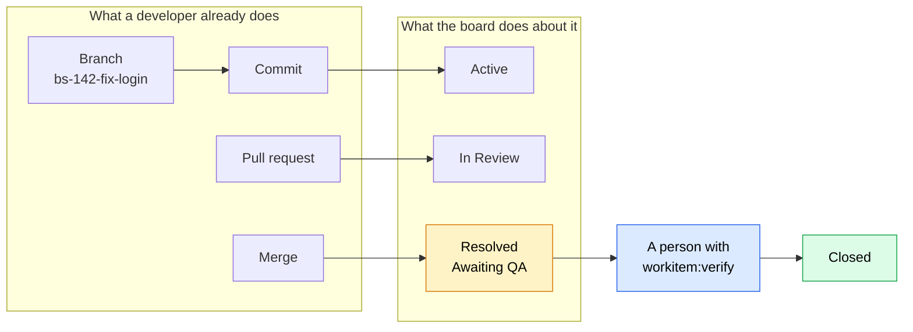

**The gap between `Resolved` and `Closed` is the product.** A merge is evidence that code
shipped, not that it works. Automation carries an item as far as *Awaiting QA* and physically
cannot go further — the integration holds `workitem:write` and deliberately not
`workitem:verify`, so the permission check refuses `Closed` no matter what the webhook handler
asks for.

That gap is also what makes the numbers mean something. **Median verification wait** — how long
finished work sits waiting to be tested — is only measurable because `Resolved → Closed` is a
real transition somebody performs, rather than a convention people follow when they remember.

---

## 2. How things are arranged

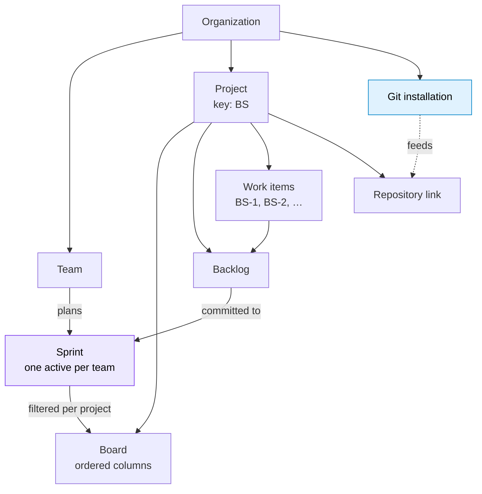

### The one thing that surprises people

**Sprints belong to teams, not projects.** A team serving three projects used to run three
concurrent sprints — three backlogs, three burndowns, three velocity charts for one team with
one capacity and one standup. Numbers that cannot be summed do not describe anything real.

So: one active sprint per team, sprint numbers per team, and a project's board shows *the
team's active sprint, filtered to that project*. Three projects served by one team means three
boards over one sprint, which is what a team working across three codebases actually looks
like.

The consequence worth knowing: **a project role does not grant sprint access.** Someone with a
direct `Contributor` grant on a project who is not on the owning team keeps the board, the
backlog and the work items, and does not see the team's sprint. They contribute to a project;
they are not part of the team planning it. Full reasoning in [ADR 001](adr-001-team-sprints.md).

### Work item references

Every item has a reference: the project's key, a dash, a number that restarts per project.
`BS-142`, `PAY-7`. Keys are 2–10 uppercase alphanumerics, unique per organization, and
**editable only at creation** — renaming one orphans every branch name in flight.

This is what you type into a branch name, and the reason it is a short readable string rather
than an id: nobody types a GUID into a branch name, and a system that asks them to will not be
used.

---

## 3. Who can do what

Three scopes. No role name means two different things at two scopes.

```mermaid
flowchart LR
    subgraph org["Organization"]
        direction TB
        OA["OrgAdmin"]
        ME["Member"]
    end

    subgraph team["Team"]
        direction TB
        TL["TeamLead"]
        SM["ScrumMaster"]
        PO["ProductOwner"]
        TM["TeamMember"]
        TT["Tester"]
        TV["Viewer"]
    end

    subgraph proj["Project"]
        direction TB
        PA["ProjectAdmin"]
        CO["Contributor"]
        PT["Tester"]
        PV["Viewer"]
    end

    %% Invisible link: orders the scopes left to right without claiming
    %% that one confers the other. The dotted edge below is the real rule.
    org ~~~ team
    team -.->|"membership reaches<br/>the team's projects"| proj

    style TT fill:#dbeafe,stroke:#2563eb,color:#000
    style PT fill:#dbeafe,stroke:#2563eb,color:#000
```

`Viewer` and `Tester` are held at more than one scope on purpose — each means the same thing at
both, read-only and testing, differing only in reach.

**The scopes are not a ladder.** Holding a role at one does not confer a role at another, with one
real exception: being on a team reaches the projects that team serves — team membership confers
Contributor there, and a Scrum Master or Product Owner reaches into every project their team
serves. That edge is the reason the app asks the server what you can do instead of working it out
from your roles; it is exactly the rule a client-side role table cannot see, and it was wrong for
precisely the people it exists for.

Roles are bundles of named permissions (`org:admin`, `sprint:scope`, `workitem:write`, …), and
**holding several roles at one scope gives you the union of what they permit** — never a rank
comparison, because a Scrum Master and a Product Owner are peers, not one above the other.

### The permission that matters most

| Permission | Held by | Not held by |
| --- | --- | --- |
| `workitem:write` | Contributor, TeamMember, and everyone above | Viewer |
| **`workitem:verify`** | **Tester, TeamLead, ProductOwner, ProjectAdmin, OrgAdmin** | **Contributor, TeamMember, ScrumMaster, and every integration** |

Every move out of `Resolved` or `Closed` needs `workitem:verify`. Everything before that needs
only `workitem:write`.

The Scrum Master exclusion is deliberate and tested: in Scrum the Product Owner accepts the
increment and the Scrum Master owns the process. It is one line in `RolePermissions` if your
team disagrees — but reversing it should be a decision, not a drift.

Nobody may certify work assigned to them unless the project sets `AllowSelfCertification`.

**The app never guesses at this.** It asks `GET /api/me/capabilities` and hides what you cannot
do; the endpoint behind every control enforces the rule again, and its 403 says which permission
was missing.

---

## 4. The life of a work item

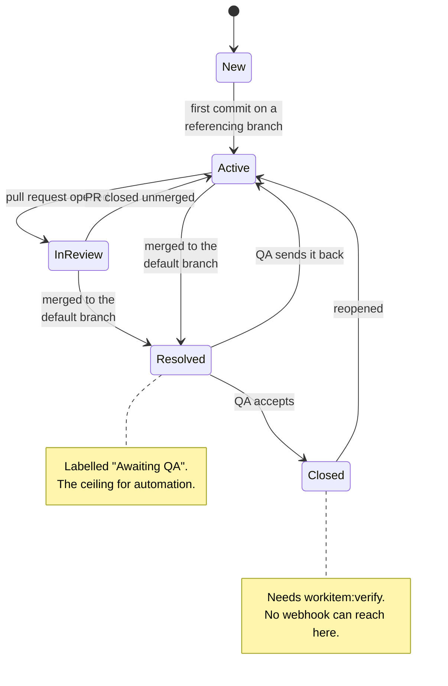

`Resolved` means **merged, awaiting test**. It is the only state from which `Closed` is
reachable, and reaching it is the one transition a machine cannot make.

**Both arrows out of `Resolved` need `workitem:verify`** — accepting and rejecting are the same
authority. So is reopening something `Closed`. Reopening stays possible on purpose: it is a real
thing that happens, and forbidding it would only push people into filing duplicates.

---

## 5. Connecting git

This trips everyone up once, because it is **two steps at two different scopes** and the second
one is invisible until the first is done.

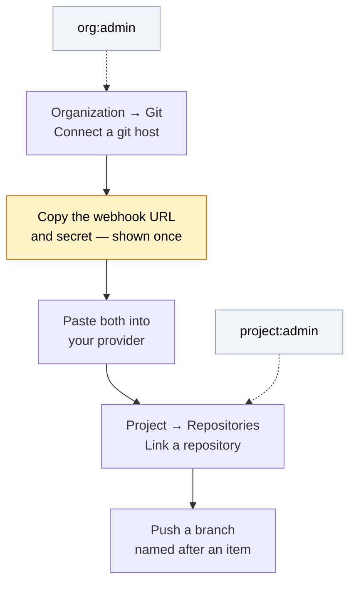

### Why you cannot find the link button

The **Repositories** page inside a project only shows its form when *both* are true: you hold
`project:admin`, and the organization already has an active installation. Until then you get a
grey note pointing at an org admin — and if you lack `project:admin`, nothing at all.

The connect button is in the **organization** sidebar (**Git**, between Activity and Settings),
not the project one.

### Step 1 — connect the host

`Organization → Git → Connect a git host`. Pick a provider, then two fields:

| Field | GitHub | GitLab | Azure DevOps |
| --- | --- | --- | --- |
| Installation ID | App installation id | Project or group id | Project id |
| Account name | The org or user, e.g. `acme` | Group or namespace | The organization |

**Neither field is verified against the provider.** There is no outbound client in this build,
so both are stored as labels for the settings screen. They have to be unique per organization
and otherwise only need to mean something to you.

The response carries a **webhook URL and secret, shown once**. Nothing readable is kept, so a
lost secret is rotated, not recovered.

### Step 2 — what each provider can prove

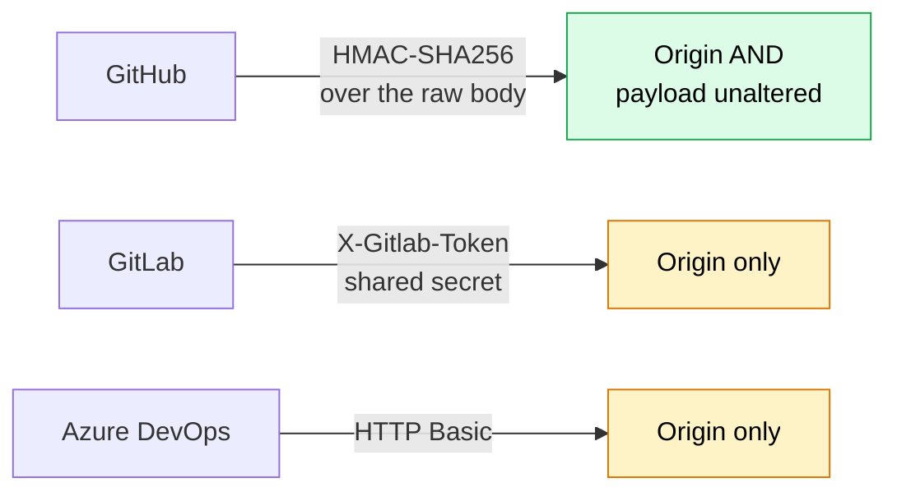

The difference is real and is **recorded on every delivery** rather than inferred from the
provider, so an audit can answer what a given event was trusted on. Azure DevOps cannot sign
payloads at all; for the two that cannot, the high-entropy segment in the webhook URL is part of
the credential.

### Step 3 — link a repository

`Project → Repositories → Link a repository`.

**The repository ID is the provider's numeric id, not the name.** Binding matches on it, and the
name beside it is only a label. On GitHub:

```bash
gh api repos/<owner>/<repo> --jq .id
```

Getting it wrong is the quiet failure: deliveries arrive, verify fine, and the log says
*unlinked repository*.

The `defaultBranch` on the link decides which merges resolve work. Leave it blank at your peril
— check what the link recorded before wondering why a merged PR did nothing.

### A personal account is fine

You do not need a GitHub App. Verification is HMAC plus the endpoint token, and a plain
per-repository webhook produces byte-identical payloads and signatures. Repo → Settings →
Webhooks → Add webhook, content type `application/json`, push and pull request events.

A GitHub App is better for a real deployment — one webhook covers every repository, permissions
are fine-grained, tokens are short-lived — but nothing in ingest requires it.

---

## 6. What happens when you push

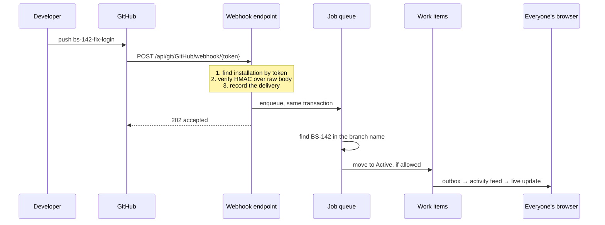

### The four rules that decide whether it moves

**Where the reference is found.** Branch name is the primary signal — a developer names a branch
once, at the moment they are already thinking about which ticket they are on. Commit messages
and pull request text are read too, so an explicit mention works, but requiring one in every
commit relies on discipline at exactly the moment nobody has any.

**A git event never moves an item backwards.** Webhooks arrive out of order routinely — a
retried push landing after the pull request it preceded — and without this a late delivery would
drag a merged item back to Active.

**A person who changed the state after the event wins.** The board is derived from git, but
somebody who deliberately overrode it knew something git did not. The event is still recorded;
it just does not move anything.

**A merge only resolves on the default branch.** Merging a feature branch into another feature
branch is ordinary work, not completion.

### The delivery log

`Organization → Git →` a connection's deliveries shows every delivery **including the ones that
deliberately did nothing** — an unhandled event, an unlinked repository, a branch naming no work
item. That is the difference between an integration that is quiet and one that is broken, and it
is the first place to look for anything in §10.

Redeliveries deduplicate on the provider's own delivery id, so replaying from GitHub is safe.

---

## 7. Planning: backlog, sprint, board

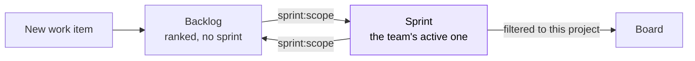

Anything committed to a sprint has left the backlog.

| Action | Needs | Checked at |
| --- | --- | --- |
| Add to, remove from, reorder the backlog | `workitem:write` | the project |
| **Commit to a sprint, or take back out** | **`workitem:write` *and* `sprint:scope`** | the project **and the sprint's team** |

The double check on the last row is deliberate, and the reason is worth knowing: the route names
a project, but the sprint belongs to a **team**, and the two need not line up. `sprint:scope` is
resolved against the sprint's own team while the route's project still has to permit the write.
Without both, the backlog would be a way around the rule the sprint's own endpoints enforce —
the same authority reached through a different door.

Deciding something is worth doing is ordinary contribution. Deciding what a sprint commits to is
not, and it belongs to the team that will have to deliver it.

Ranks are opaque — compare them, never compute with them. Reordering sends the whole ordered
list and the server recomputes.

---

## 8. Reports

Five tabs, and **every figure is computed from `WorkItemHistory` by reconstructing state
transitions.** Nothing is snapshotted nightly, so a burndown is correct for a sprint that ran
before the feature existed, and cannot be wrong because a job did not run.

| Tab | Status |
| --- | --- |
| Overview | Committed, verified, awaiting QA, not started, plus cycle time |
| Burndown | Points **and** items — unestimated work makes a flat points line and a falling item line |
| Velocity | Completed sprints only; an in-flight sprint would look like a collapse |
| | **Measured at the sprint boundary** — see below |
| Cumulative Flow | **Not computed.** Says so rather than showing invented numbers |
| Team Performance | **Not computed.** Same |

### What "completed" means, and when it is counted

**A sprint's completed points are the work closed on or before its end date** — not the work that is
closed now. Both the summary and the burndown apply that same rule, so what the burndown shows as
remaining at the end and what the summary shows as delivered add up to what the sprint committed.

The consequence is deliberate: **a finished sprint's velocity never changes again.** Closing a stale
item three weeks later counts toward nothing — it was committed to that sprint, and that sprint did
not deliver it. Counting it would raise a past bar with no event to explain the change, and would
flatter exactly the teams that habitually carry work over, which are the ones whose forecast should
be least flattered.

Active sprints are unaffected, because their end date is in the future.

**Awaiting QA is the exception and stays a "right now" figure.** How much is sitting in the QA lane
is a question about the present on a running sprint, and on a finished one it answers "what did this
leave behind that is still waiting" — freezing it at the end date would answer neither.

Medians rather than means throughout, because one item that sat in a backlog for three months
drags an average somewhere nobody recognises — and a figure nobody recognises gets ignored.

`null` in a cycle-time figure means *not enough closed work to say*. It does not mean zero.

---

## 9. The AI half

Two features, one principle: **the model proposes, a human accepts, only the acceptance writes.**

### Decomposition — a document becomes a reviewable plan

`Project → Decompose`. Needs `workitem:write` — gated on creating work rather than reading it,
because a decomposition spends the organization's money.

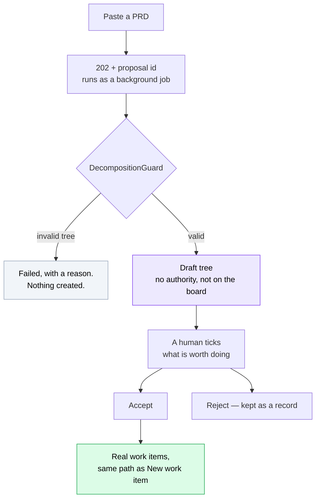

The guard runs **before a human sees anything**: the nesting rule
(`Epic → Feature → Story → Task/Bug`), a 150-node cap, title and estimate limits, duplicate
siblings. Structured output constrains the JSON shape and has no opinion about whether a Task may
sit under an Epic — the domain does. A prompt is a request; only the guard is a guarantee.

Estimates outside the accepted range are **dropped, not clamped**. Clamping 9000 to 1000 keeps a
number nobody meant, and story points are read as a judgment about size.

#### The selection rule, which is the whole design

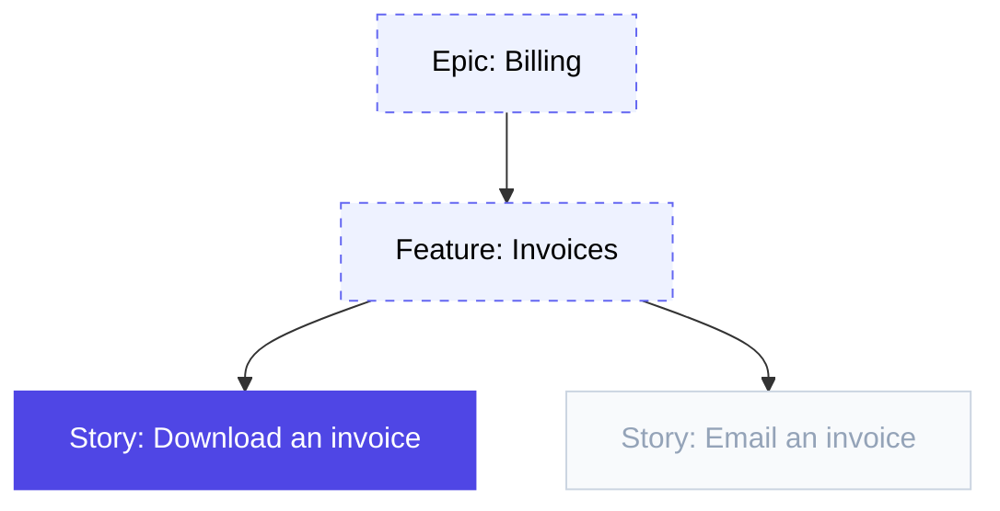

Tick one story and **its ancestors come with it** — solid is what you chose, dashed is carried
in. A story cannot be created under a feature that was not; the parent would not exist. The
alternatives were worse: refusing the selection makes you rebuild the tree by hand, and
reparenting the story to the top level silently changes what it means, because a story's parent
is most of its context.

**Ticking a node does not take its descendants.** Accepting an epic and silently getting forty
tasks nobody read is the failure the whole design prevents. Taking a subtree is a separate,
explicit press.

Acceptance runs in **one transaction** — a failure on the twentieth of forty items would
otherwise leave nineteen real work items and a proposal you could accept again.

Full reasoning in [ADR 002](adr-002-proposals.md).

### Narrative — prose over figures somebody else computed

`Project → Reports → Overview`, below the numbers. **Press the button; it does not run on page
load** — every request reaches the model and charges the organization's daily allowance, and a
report that regenerated its own commentary on every visit would also reword itself under a team
mid-conversation.

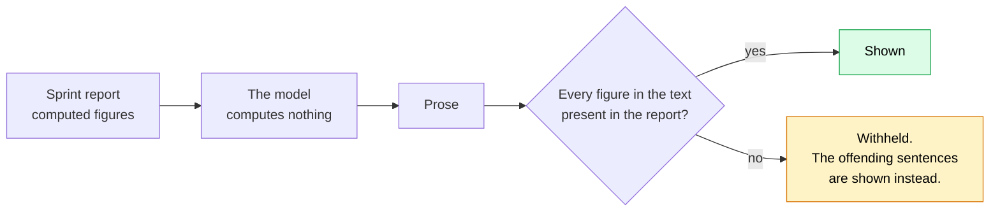

The module that narrates is separate from the module that computes, and deliberately so: a model
asked to both compute and narrate returns plausible numbers that nobody downstream can tell apart
from real ones.

**When the check fails, the prose is withheld rather than trimmed.** Dropping the offending
sentence would leave a paragraph that reads perfectly well, no longer says what was meant, and
gives a reader no way to tell anything was removed.

### Known gaps

- **Neither has run against the real API** — there is no key in the build environment. Everything
  around the model call is tested against a fake.
- Prompt caching is specified and not implemented; the call is not streamed.
- The token allowance is in-memory: per instance, reset daily, forgiven on restart. A cost guard,
  not billing.

---

## 10. When a card does not move

Work down this list. The delivery log answers most of it.

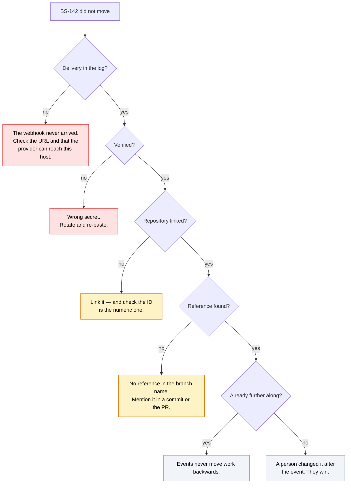

Two more worth knowing:

**A merged PR reached Resolved and stopped.** Working as designed. Somebody with
`workitem:verify` closes it.

**A local instance receives nothing.** GitHub cannot reach `localhost`. You need a tunnel and
`APP_BASE_URL` pointed at it, or the webhook URL handed to you is unreachable.

---

## Further reading

| Document | What it covers |
| --- | --- |
| [`adr-001-team-sprints.md`](adr-001-team-sprints.md) | Why sprints moved from projects to teams |
| [`adr-002-proposals.md`](adr-002-proposals.md) | Why AI output lands as a proposal |
| [`permissions-model.md`](permissions-model.md) | The full permission model |
| [`realtime-frontend.md`](realtime-frontend.md) | The live-update hub |
| [`../README.md`](../README.md) | Setup, configuration, API surface |
